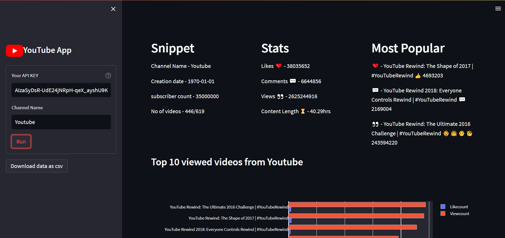
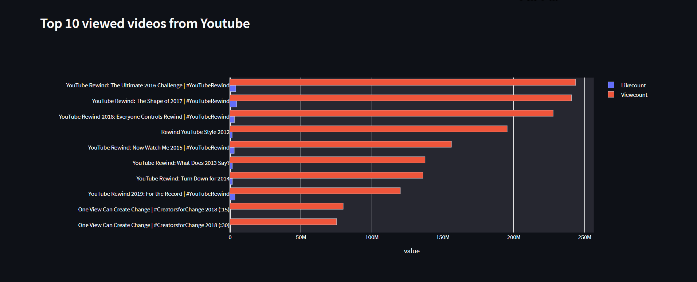
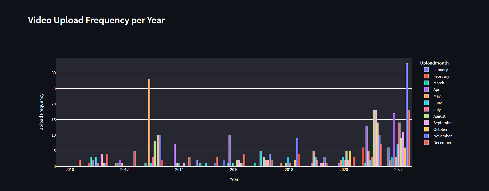

# Youtube-Channel-Analyser

## Description
This app fetches YouTube channel metadata using YouTube Data Api V3 and gives Exploratory data analysis of YouTube channel. It takes Youtube Api key and Channel name as input. By using Youtube Api data is collected. Using pandas data is transformed. Streamlit is used to Visualize the data.

## Features
- All time channel stats
  - Total Likes
  - Total comments
  - Total views
  - Total content length
- All time top videos
  - Most liked
  - Most Viewed
  - Most commented
- Data can be downloaded in csv form 

## Quick glance at the results





## Run Locally
Initialize git
```
git init
```
Clone the project
```
git clone https://github.com/mahhheshh/Youtube-Channel-Analyser.git
```
enter the project directory
```
cd Youtube-Channel-Analyser
```
Create a virtual environment and install all the packages from the environment.yml (recommended)
```
python -m venv .venv
```
Activate the virtual environment
```
.venv/Scripts/Activate.ps1
```
install required packages
```
pip install -r requirements.txt
```
start the streamlit server locally
```
streamlit run main.py
```

## License
MIT License

Learn more about [MIT](https://choosealicense.com/licenses/mit/) license